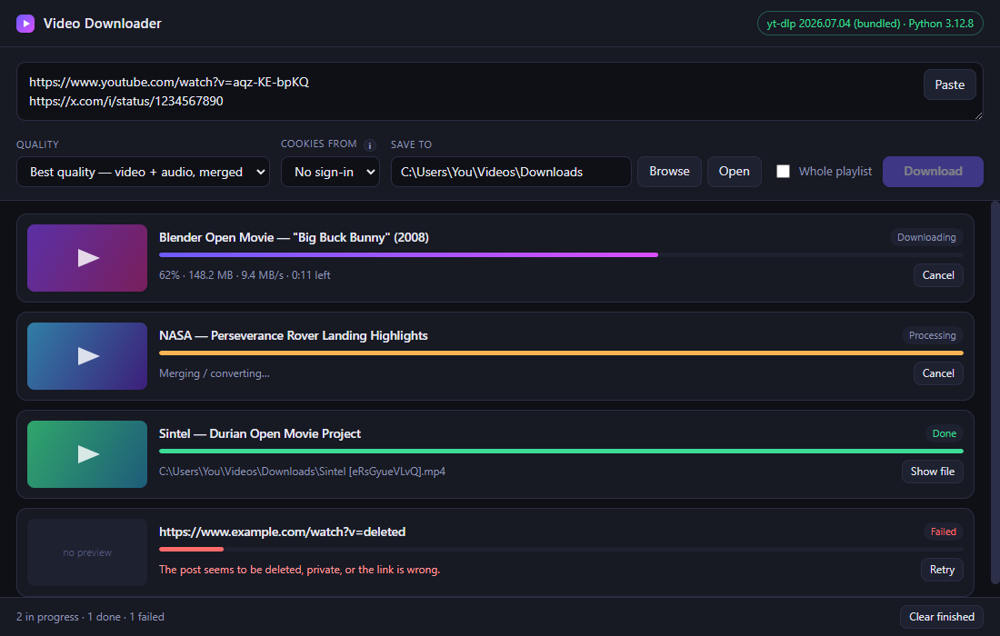

<div align="center">

# Video Downloader

**A desktop app for saving videos, Reels and Shorts from YouTube, X, Instagram, Facebook, TikTok, Reddit and ~1800 other sites.**

Paste links, pick a quality, get files. No ads, no upload limits, no website in the middle.

[**Download for Windows →**](../../releases/latest)



</div>

---

## What it does

- **Batch downloads** — paste as many links as you like, one per line. Three run at once.
- **Quality picker** — best available down to 480p, smallest-file, or audio-only (MP3 / original).
- **Live progress** — thumbnail, progress bar, speed and ETA per download, with cancel and retry.
- **Signed-in downloads** — optionally borrow your browser's session for private X posts, Instagram, or age-restricted YouTube.
- **Survives flaky sites** — transient failures retry automatically; real errors are explained in plain English instead of stack traces.
- **Drag and drop** — drop a link straight from your browser onto the window.

Built on [yt-dlp](https://github.com/yt-dlp/yt-dlp), which does the actual extraction.

## Install

### Windows

1. Download **`Video Downloader Setup x.y.z.exe`** from the [latest release](../../releases/latest).
2. Run it. It installs per-user — no admin rights needed.
3. Windows SmartScreen will warn you because the app isn't code-signed (a signing certificate costs money). Click **More info → Run anyway**.

> [!IMPORTANT]
> **Python 3.9 or newer must be installed** and on your PATH. The app bundles yt-dlp itself, but not a Python interpreter.
> Get it from [python.org](https://www.python.org/downloads/) and tick **"Add Python to PATH"** during install.
> If the app shows *"Engine unavailable"*, this is almost always why.

### ffmpeg (strongly recommended)

Without ffmpeg you only get streams that arrive as a single file — on YouTube that caps you at **720p** — and MP3 conversion is unavailable. The app detects this and tells you in the status bar.

```powershell
winget install Gyan.FFmpeg
```

Restart the app afterwards. Alternatively, drop `ffmpeg.exe` into the app's `resources/app.asar.unpacked/engine/bin/` folder — the app checks there first.

### macOS / Linux

No prebuilt binaries yet. Build from source (below) — the app itself is cross-platform.

## Using it

1. Paste one or more links into the box. **Ctrl+Enter** starts them, or click **Download**.
2. Pick a quality and a folder to save to. Both are remembered.
3. Watch the queue. Cancel anything mid-flight; failed items get a **Retry** button.

**Whole playlist** is off by default, so a link pointing at one video inside a playlist grabs just that video. Tick it to pull the entire playlist or channel.

**Cookies from** — leave on *No sign-in* unless a download fails asking for a login. When you do need it, close the chosen browser first: Chrome and Edge lock their cookie database while running.

Files are saved as `Title [id].ext`.

## Privacy

| Data | Where it goes |
|---|---|
| Browser cookies | Read from your browser profile **only while a download runs**, held in memory, sent only to the site being downloaded from. Never written to disk by this app. |
| Settings | Your download folder, quality, and the browser's *name* (`"chrome"`) — never its contents. Stored per-user, outside the app. |
| App's own cookie jar | Emptied at every launch; `Set-Cookie` is stripped from all responses so thumbnail CDNs can't write to it. |
| Telemetry | None. There is no analytics, no update check, no phone-home. |

The app window is also blocked from making any network request that isn't a thumbnail image. See `hardenSession()` in [`electron/main.js`](electron/main.js).

Be aware that reading a browser's cookie database is a privileged operation — the same thing credential-stealing malware does. That's why it's opt-in, off by default, and explained in-app before you enable it. Antivirus tools may flag the app on those grounds.

## Build from source

Requires [Node.js 18+](https://nodejs.org) and Python 3.9+.

```bash
git clone https://github.com/KKtyagi11/video-downloader.git
cd video-downloader/electron
npm install
npm run setup     # fetches yt-dlp into engine/vendor
npm start
```

Package an installer:

```bash
npm run dist      # Windows NSIS installer into electron/dist/
```

Regenerate the icon after changing its colours, or the README screenshot after
changing the UI:

```bash
npm run icon        # needs Pillow: pip install pillow
npm run screenshot  # renders the real UI with sample rows into docs/
```

Releases are built by [GitHub Actions](.github/workflows/release.yml): push a
tag like `v1.1.0` and the installer is built on a clean Windows runner and
attached to the release automatically. Run the workflow manually from the
Actions tab to test a build without publishing.

## How it works

```
┌─────────────┐  IPC (contextBridge)  ┌──────────┐  JSON-lines over stdio  ┌───────────┐
│  renderer   │ ────────────────────► │  main.js │ ──────────────────────► │ engine.py │
│  (no Node)  │ ◄──────────────────── │          │ ◄────────────────────── │  yt-dlp   │
└─────────────┘   job-update events   └──────────┘   {"type":"job",...}    └───────────┘
```

yt-dlp is a Python project with no maintained JavaScript equivalent, so the app drives it as a library from a Python sidecar rather than shelling out to a binary. That buys structured exceptions and clean mid-download cancellation, at the cost of requiring an interpreter.

| Path | Role |
|---|---|
| [`electron/main.js`](electron/main.js) | Window, settings, dialogs, sidecar supervision, session hardening |
| [`electron/preload.js`](electron/preload.js) | The entire renderer API surface — 12 calls |
| [`electron/engine/engine.py`](electron/engine/engine.py) | yt-dlp driver: thread pool, progress, retry, cancel |
| [`electron/renderer/`](electron/renderer) | UI — no framework, no build step |
| [`app/`, `main.py`](app) | A minimal Tkinter front-end sharing the same approach, if you'd rather not install Node |

**Security posture:** `contextIsolation: true`, `nodeIntegration: false`, a CSP permitting only self-hosted scripts and styles, in-app navigation blocked, external links forced to the system browser.

## Troubleshooting

| Symptom | Fix |
|---|---|
| **"Engine unavailable"** | Python isn't installed or isn't on PATH. Install from python.org with "Add to PATH" ticked, then restart the app. |
| **Can't get above 720p on YouTube** | ffmpeg is missing. YouTube serves 1080p+ as separate video and audio streams that must be merged. |
| **MP3 greyed out** | Same — ffmpeg does the conversion. |
| **A site suddenly stops working** | Sites change their players constantly. Run `npm run update-ytdlp` from source, or `py -3 -m pip install -U yt-dlp` (a system copy takes precedence over the bundled one). |
| **"Needs a signed-in session"** | Set **Cookies from** to a browser logged into that site, and close that browser first. |
| **Facebook fails intermittently** | Facebook serves a page variant yt-dlp can't parse now and then. Retries are automatic; signing in via cookies makes it much more reliable. |

## Legal

Download only what you have the right to: your own uploads, public-domain or openly licensed material, or content whose terms permit it. Many platforms' terms of service restrict downloading, and copyright law applies regardless of what a tool makes technically possible.

This app does not bypass DRM or paywalls, and it does not circumvent access controls — it retrieves content already served to your session.

You are responsible for how you use it.

## License

[MIT](LICENSE). Bundles [yt-dlp](https://github.com/yt-dlp/yt-dlp) (Unlicense), fetched at setup time.
